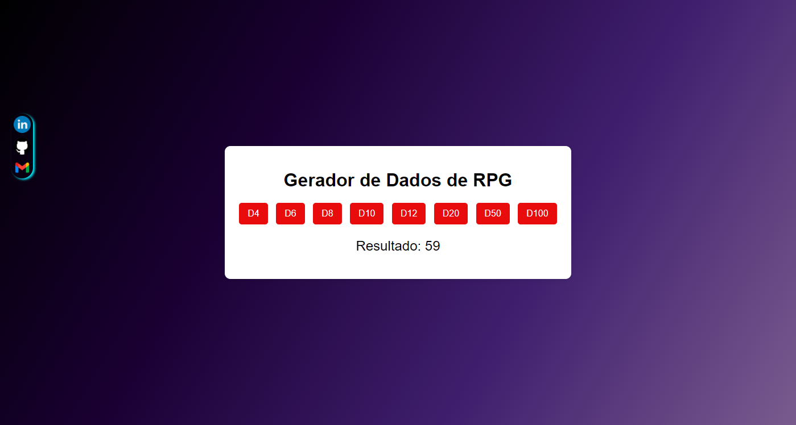

# ReverseFlux
Escreva palavras invertidas 

# RollForAdventure
Rolagem de dados RPG

# Rolagem de Dados de RPG

Este projeto é uma aplicação simples em HTML, CSS e JavaScript que inverte as letras de cada palavra de um texto sem alterar a ordem das palavras. O usuário insere um texto, e ao clicar no botão, o texto processado aparece logo abaixo.

## Demonstração

 

## Funcionalidades

- Entrada de texto em um campo de formulário.
- Botão para inverter as letras de cada palavra.
- O texto processado é exibido instantaneamente na tela após o clique.

## Tecnologias Usadas

- **HTML**: Estrutura do site.
- **CSS**: Estilização e design.
- **JavaScript**: Lógica para inversão das palavras.

## Como Usar

1. **Clone o repositório** ou faça o download dos arquivos.
   ```bash
   git clone https://github.com/TIAG0MIRANDA/ReverseFlux.git
